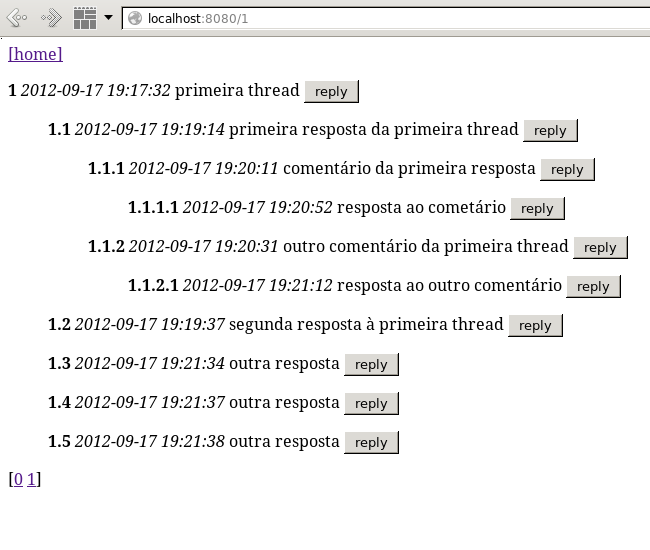
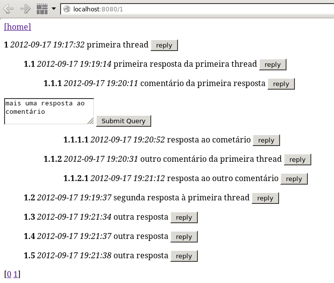
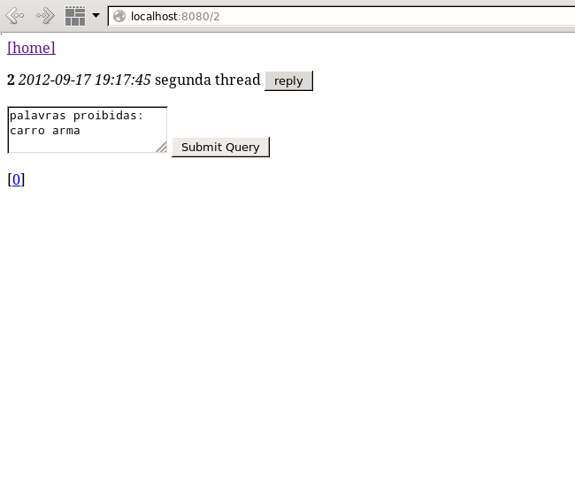
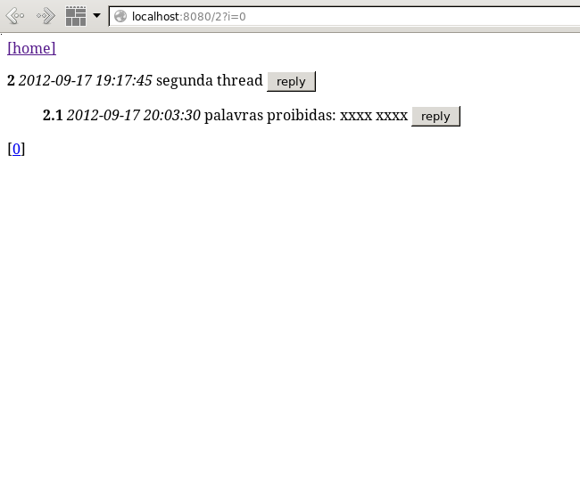
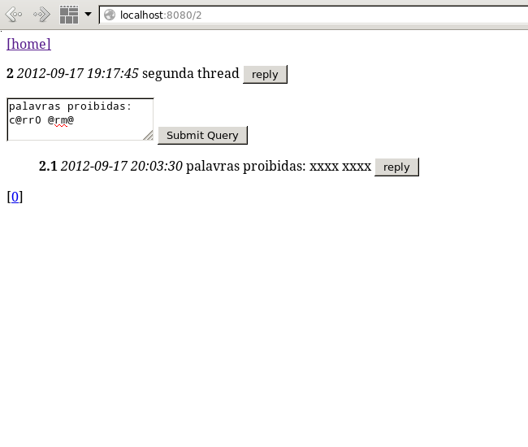
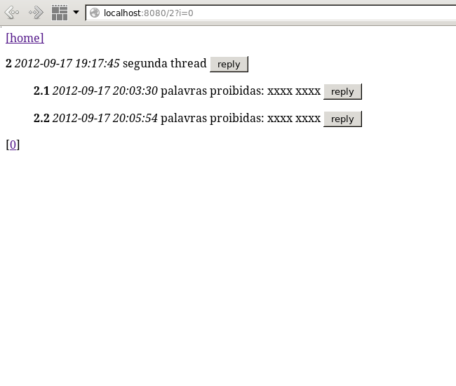

# TESTE PRÁTICO BACK-END

### Objetivo

Seu objetivo nesse teste é construir um protótipo simplificado de um FÓRUM DE DISCUSSÃO web.
A discussão se dá em threads (tópicos) e comentários encadeados no estilo árvore. A interface web deve contemplar:

### Teste 

* Uma listagem das threads com paginação, apresentando opção (Título e botão) para criar uma nova thread (figura 1).

* Cada thread deve exibir os comentários em árvore (figura 2a), sendo cada  comentário acompanhado de um formulário para resposta (figura 2c).

* Os tópicos e os comentários também devem ser paginados;

* Uma complicação é que comentários com palavras presentes em uma blacklist devem ser rejeitados (figura 3a,b). Tratando tantas variações quando possíveis (figura 3c,d).

Você pode usar tecnologias (frameworks, servidores web, bancos de dados, etc.) de sua preferência, com duas ressalvas:

* A primeira é não usar um produto de fórum pronto.
* A blacklist deve ser criada manualmente e em Ruby, sem usar ferramentas, frameworks ou gems;

Levaremos em conta a qualidade do código, Legibilidade, Testes, Documentação e a performance do sistema, sob carga e volume de dados.

__Não se preocupe com testes Cross browser ou mobile. Foque no Backend e boas práticas de Eng. Software - Para a avaliação não levaremos em conta qualidades estéticas nem usabilidade das páginas.__
 
##### Figura 1

##### Figura 2a

##### Figura 2c

 
##### Figura 3a

##### Figura 3b

##### Figura 3c

##### Figura 3d
